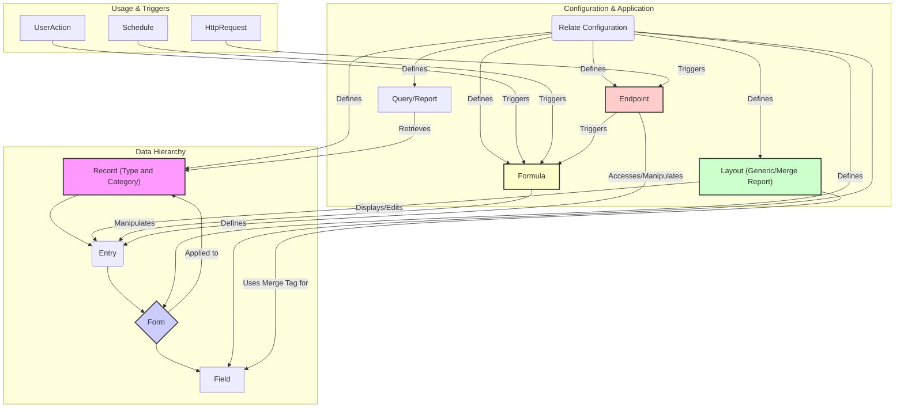

# BlueStep Context for AI Models (Enhanced)

## 1. Introduction

BlueStep is a Software-as-a-Service (SaaS) application built on a Java platform with specialized focus on healthcare information management. Its primary purpose is to allow business users to define custom data structures (Forms, Fields) and associated workflows without traditional programming. The platform supports multiple healthcare verticals including Assisted Living, Skilled Nursing, Behavioral Health, and Medical Services Administration (MeSA).

## 2. Core Data Hierarchy

BlueStep organizes data hierarchically. Understanding these relationships is key:

*   **Record:**
    *   The central data entity in BlueStep, analogous to a master object or record instance.
    *   Uniquely identified by its **Record Type** and **Record Category**.
    *   Acts as a container for related **Entries**.
    *   The specific Forms applicable to a Record are determined by its Type/Category combination and the "Relate" configuration.
    *   In healthcare contexts, Records often represent patients, facilities, or organizations.

*   **Record Type:**
    *   A broad classification for Records (e.g., `Individual`, `Facility`, `Organization`).
    *   Each Record Type has a special, defining Form called the "Record Type Form".
    *   Healthcare-specific Record Types include `Resident`, `Patient`, and `Community`.

*   **Record Category:**
    *   A more specific sub-classification applied to one or more **Record Types** (e.g., `Active Client`, `Inactive Client`, `Main Facility`, `Satellite Facility`).
    *   Helps determine which **Forms** (beyond the Record Type Form) apply to a **Record**.
    *   Categories can define clinical pathways or care designations (e.g., `Short-Term Care`, `Memory Care`).

*   **Form:**
    *   A collection of related **Fields**, analogous to a database table.
    *   Applied to specific **Record Types** or **Record Categories**.
    *   Can be configured as:
        *   **Single-Entry:** Only one instance of this Form can exist per Record.
        *   **Multi-Entry:** Multiple instances (Entries) of this Form can exist per Record.
    *   Healthcare examples include `Medication Administration Record`, `Assessment`, or `Progress Note`.

*   **Field:**
    *   An individual data point within a **Form**, analogous to a database column.
    *   Has a defined data type (Text, Number, Date, Lookup, etc.) and specific configuration (validation, required, visibility).
    *   They are accessed by script via an optional `formulaId` in RelateScript or `FID` Alt Id (also known as Custom Lookup Property)
    *   They have a `styleClass` property that adds an HTML class to the rendered field on the FE. This allows for custom Javascript Behavior.
    *   Specialized field types include clinical measurements (vitals), medication-specific fields, and signature fields.

*   **Entry:**
    *   A specific instance of a **Form** associated with a **Record**, analogous to a database row.
    *   Contains the actual data values for the **Fields** defined in that Form.
    *   In healthcare, an Entry might represent a single medication administration event, vital sign measurement, or clinical note.

## 3. Configuration ("Relate")

"Relate" is the administrative section of BlueStep where configuration occurs. Key components configured here include:

*   **Record Types:** Define the core object types in the system (e.g., `Individual`, `Facility`)
*   **Record Categories:** Define specialized sub-classifications for Records
*   **Forms:** Define data collection templates with field definitions and validation rules
*   **Fields:** Define individual data elements with type, validation, and UI properties
*   **Option Lists:** Define predefined value sets for dropdowns and lookup fields
*   **Queries:** Define data retrieval parameters for searching and reporting
*   **Reports:** Define how to display retrieved data in tabular or list formats
*   **Formulas:** Define calculated fields and business logic operations
*   **Merge Reports:** Define custom layouts and specialized UI components  
*   **End Points:** Define API integration points for third-party systems

## 4. Data Retrieval and Presentation

*   **Queries & Reports:**
    *   Used for searching, retrieving, and displaying data based on specified criteria.
    *   Configured based on **Record Types** and **Record Categories**.
    *   Search criteria are defined using **Fields** from applicable **Forms**.
    *   Results display selected **Fields**.
    *   **Important:** Each row/result represents a single **Record** and one specific **Entry** for each included Form (even if the Form is multi-entry, the query targets *one* specific entry based on criteria or defaults).
    *   Healthcare examples include medication reports, census reports, and clinical assessment summaries.

*   **Layouts & Rendering:**
    *   Define how **Entries** (Form data) are displayed and edited on a **Record**.
    *   **Generic Layout:** The standard, configuration-driven method. Allows setting properties like:
        *   Required fields
        *   Conditional visibility (e.g., "Show Field B if Field C equals 1")
        *   Validation rules (e.g., max length, numeric range).
    *   **Merge Report:** Used when the Generic Layout is insufficient. Allows creating custom HTML/CSS/JavaScript interfaces. Can run in multiple contexts (see Section 5).
        *   **RelateScript:** An older, proprietary scripting language (loosely resembles JavaScript).
        *   **bsjs:** The newer method, allowing **TypeScript** code. This code is compiled to JavaScript and executed server-side via the GraalVM Java library.
    *   **Merge Tag:** The core mechanism for rendering an editable **Field** within *any* layout (Generic or Merge Report). It references a specific field within a form's entry (e.g., `[FormName.FieldName]`). The tag belongs to an **Entry**, which belongs to a **Form**, which is associated with a **Record**.
    *   **Compound Forms:** A special approach for complex layouts where multiple logical forms are rendered as a single, seamless interface:
        *   Used for forms with repeating sections of unknown length
        *   Used for complex forms with conditional sections based on user selections
        *   Implemented via a master form + dynamically included sub-forms
        *   Requires special handling for data saving, cancellation, and validation

## 5. Automation, Customization, and Integration (Scripts & Endpoints)

BlueStep provides several mechanisms for automating processes, customizing displays beyond Generic Layouts, and integrating with external systems.

*   **Formulas:**
    *   Used to manipulate data based on triggers or schedules. There are 3 primary types:
        *   **Scheduled Formulas:** Run automatically on a defined schedule. Configured with Record Types/Categories to target specific Records. Executes the formula logic for each matching Record found by an underlying temporary query.
        *   **On-Demand Formulas:** Primarily used for asynchronous operations. Triggered programmatically from other Formulas or End Points.
        *   **Action Formulas:** Triggered by specific user actions during data entry/editing:
            *   **Pre-Edit:** Runs *before* an Entry is displayed for editing. Useful for setting default values or performing pre-calculations.
            *   **Pre-Save:** Runs *after* the user clicks 'Save' but *before* data is committed to the database. Used for complex validation logic.
            *   **Post-Save:** Runs *after* data has been successfully saved. Commonly used for triggering subsequent calculations, updating related data, or initiating workflows.
            *   **Pre-Delete:** Runs *after* a user initiates deletion but *before* the Entry is removed. Allows for validation to prevent or confirm deletion.
    *   Healthcare applications include:
        *   Automated assignment of care plans based on assessments
        *   Calculation of clinical scores from assessment data
        *   Medication schedule generation and updates
        *   Triggering notifications for critical clinical values

*   **Merge Reports (Contexts):**
    *   Beyond replacing Generic Layouts (Section 4), Merge Reports can run in other contexts:
        *   **Pagelet Merge Report:** Added to various BlueStep pages (not tied to a specific Record/Entry). Primarily used to inject custom JavaScript for page-wide modifications or features.
        *   **Record Nav Merge Report:** Added as a custom tab or section within a Record's navigation menu (alongside Forms). Used to display aggregated data, charts, custom reports, or summaries related to the Record.
        *   **Entry Layout Merge Report:** Replaces the standard display/edit layout for a specific Form's Entry (as mentioned in Section 4).
        *   **Field Merge Report:** Allows embedding Merge Report logic (often JavaScript) within a specific Field area on a *Generic* Layout, offering targeted customization without a full layout replacement.
    *   Healthcare applications include:
        *   Custom clinical dashboards for patient overview
        *   Interactive care planning interfaces
        *   Medication administration records with complex validation rules
        *   Treatment flowsheets with conditional logic

*   **End Points:**
    *   Enable creating custom APIs within BlueStep.
    *   Triggered by external HTTP requests.
    *   Configuration includes defining the URL path, allowed HTTP Methods (GET, POST, etc.), IP address restrictions (whitelisting/blacklisting), and required permissions.
    *   Can execute script logic (similar to Formulas) to interact with BlueStep data.
    *   Can also trigger asynchronous operations, similar to On-Demand Formulas.
    *   Healthcare applications include:
        *   Integration with electronic health record (EHR) systems
        *   Connection to pharmacy systems for medication data
        *   Integration with laboratory information systems
        *   Mobile application data exchange

## 6. Specialty Features for Healthcare

BlueStep offers specialized features for healthcare workflows, particularly evident in the Medication Administration Record (MAR) implementation:

*   **MAR System Architecture:**
    *   Multi-entry form system on Individual Resident Records
    *   Custom Merge Report-based layout (not using Generic Layout)
    *   Dynamic components controlled by Community Record settings
    *   Uses RelateScript and bsjs for business logic implementation

*   **Advanced Clinical Rules:**
    *   Exception-Based Requirements: Notes required for specific exceptions, Vitals required for specific exceptions
    *   Medication-Specific Rules: PRN interval rules, Pain level tracking, Glucose sliding scale
    *   Signature Requirements: Prep Signature, Administration Signature, Effectiveness Follow-up Signature
    *   Dynamic field visibility based on medication type and administration status

*   **Clinical Data Collection:**
    *   Pain tracking with pre/post administration measurements
    *   Vital signs monitoring (BP, HR, Temperature, Glucose, Respiratory Rate, Weight, O2 Saturation)
    *   Medication effectiveness tracking
    *   Medication destruction tracking for controlled substances

*   **Technical Implementation:**
    *   TypeScript-based schema definition
    *   Conditional validation and field requirements
    *   GraphQL for form data querying
    *   Business rule processing for medication-specific rules
    *   Comprehensive validation framework
    *   Signature workflow system

## 7. Key Relationships Summary

## 8. Example Scenario

This example illustrates the concepts in a healthcare context:

#### Record Types
*   `Resident` <!-- Record Type -->
*   `Community` <!-- Record Type -->

#### Record Categories
*   `Memory Care` <!-- Category applied to Resident Type -->
*   `Skilled Nursing` <!-- Category applied to Resident Type -->

#### Forms & Fields

*   **Resident Information Form** <!-- Record Type Form for 'Resident' -->
    *   **Configuration:** Single-Entry
    *   **Fields:** Name (Text), DOB (Date), Room (Text), Admission Date (Date), Primary Physician (Lookup), Medicare ID (Text), Allergies (Text - Calculated via Formula)

*   **Memory Care Assessment Form**
    *   **Configuration:** Applies only to `Memory Care` Category, Single-Entry
    *   **Fields:** Cognitive Score (Number), Wandering Risk (Lookup), Orientation Score (Number)

*   **Nursing Assessment Form**
    *   **Configuration:** Applies only to `Skilled Nursing` Category, Single-Entry
    *   **Fields:** Acuity Level (Lookup), IV Access (Text), Wound Care (Text)

*   **Community Information Form** <!-- Record Type Form for 'Community' -->
    *   **Configuration:** Single-Entry
    *   **Fields:** Community Name (Text), License Number (Text), Administrator (Text)

*   **Medication Administration Record**
    *   **Configuration:** Applies to `Resident` Type, Multi-Entry
    *   **Fields:** Medication Name (Text), Dose (Text), Route (Lookup), Schedule (Text), Notes (Text), Administration Time (DateTime), Administered By (Signature)

**Explanation & Potential Scripts:**

*   A `Record` with Type=`Resident` and Category=`Memory Care` would have the `Resident Information` Form, the `Memory Care Assessment` Form, and the `Medication Administration Record` Form applicable.
    *   *Formula Example:* A Post-Save Formula on the `Memory Care Assessment` Form could automatically update care plan recommendations based on cognitive scores.
*   A `Record` with Type=`Resident` and Category=`Skilled Nursing` would have the `Resident Information` Form, the `Nursing Assessment` Form, and the `Medication Administration Record` Form applicable.
    *   *Merge Report Example:* A sophisticated Medication Administration Record merge report could implement PRN interval checking, pain assessments, and vitals monitoring for specific medications.
*   A `Record` with Type=`Community` would have the `Community Information` Form.
    *   *Endpoint Example:* An Endpoint could be created to allow an electronic health record system to query current resident census and medication administration data.

## 9. Technical Implementation Details

*   **RelateScript API:**
    *   Proprietary scripting language for manipulating BlueStep data and UI elements
    *   Provides global objects like `Entry`, `Record`, and `Form` for data manipulation
    *   Offers DOM manipulation capabilities via `Element` object
    *   Supports event handling through listeners and callbacks
    
*   **bsjs (BlueStep JavaScript/TypeScript):**
    *   Modern TypeScript-based programming interface
    *   Compiled to JavaScript and executed server-side via GraalVM
    *   Organized into modules (B, Java, Graal, Polyglot)
    *   Provides APIs for data access, validation, and business logic
    *   Supports integration with Java libraries through polyglot bindings

*   **GraphQL Implementation:**
    *   Supported for querying form data and relationships
    *   Allows efficient retrieval of complex data structures
    *   Used extensively in modern BlueStep implementations
    *   Reduces payload size compared to traditional API approaches

*   **Web Interface:**
    *   Modular web-based interface with responsive design
    *   Dynamic CSS variables for theming and styling
    *   Component-based architecture with expandable/collapsible sections
    *   Support for modals, tree views, and asynchronous content loading
    *   Note: Does not support Internet Explorer

## 10. Documentation Links

*   **Main Platform Support:** [BlueStep Platform Support](https://bluestepplatformsupport.bluestep.net/shared/layouts/singleblock.jsp?_event=view&_id=120130___194606)
*   **Relatescript Support Home:** [Relatescript Support](https://bluestepplatformsupport.bluestep.net/shared/custompage/custompage.jsp?_event=view&_id=445506___3121)
*   **bsjs Documentation (TypeDoc):** [bsjs TypeDoc](https://bluestepplatformsupport.bluestep.net/jslib/docs/B/)
*   **Relate Components Home:** [Relate Components](https://bluestepplatformsupport.bluestep.net/shared/custompage/custompage.jsp?_event=view&_id=445506___8181)
*   **Compound Form Problem:** [Compound Form Documentation](https://bluestepplatformsupport.bluestep.net/shared/custompage/custompage.jsp?_event=view&_id=445506___8822)
*   **General BlueStep Support:** [BlueStep Support Portal](https://support.bluestep.net/home.jsp)

## 11. TODO & Areas for Clarification

*   [ ] Define/Explain Record Navigation structure in more detail
*   [ ] Define/Explain Unit Structure and its relation to Records/Permissions
*   [ ] Detail the Permissions model (how access to Records, Forms, Fields is controlled)
*   [ ] Describe Site Structure (how different parts of the application are organized for users)
*   [ ] List and describe common Site Components
*   [ ] Explain Custom Queries (beyond the basic Queries/Reports mentioned)
*   [ ] Provide concrete Script Examples (RelateScript/bsjs) for common healthcare workflows
*   [ ] Explain how Script Imports work in both RelateScript and bsjs
*   [ ] Add more detailed "script" scenarios for medication administration
*   [ ] Provide detailed descriptions for healthcare-specific Field Types
*   [ ] Provide a Container Tree Example for a clinical application
*   [ ] Expand detail on GraphQL implementation and available operations
*   [ ] Clarify the exact execution environment/context for bsjs scripts
*   [ ] Document the specific requirements for different endpoint types
*   [ ] Detail the integration patterns for EHR and pharmacy systems
*   [ ] Document the specific validation rules available for clinical data